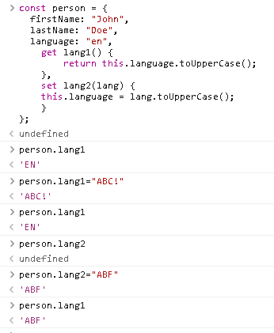

# Javascript

## Day 1
* Intro to javascript with wikipedia.
* Objects intro by Youtube @Fatz
[Spanish]: [](https://youtu.be/N_t1A39IB_8 "Curso de Javascript Orientado a Objetos para Principiantes")
* w3schools: [JavaScript Objects: properties and methods](https://www.w3schools.com/js/js_object_definition.asp)

[comment]: <> (https://video-to-markdown.marcomontalbano.com/)
---
# Stacks
* [Row functions](https://twitter.com/lupitacode/status/1524910302311088134?s=20&t=ir417jg0H79zcS8UL0swlA)
* [React JS bootcamp 8h](https://youtu.be/6Jfk8ic3KVk)
* [Unpack](https://developer.mozilla.org/en-US/docs/Web/JavaScript/Reference/Operators/Destructuring_assignment)
* [50+ Project Ideas For JavaScript Learners, From Beginner To Advanced!](https://twitter.com/Amit_T18/status/1525069603944034304?s=20&t=fqf9rynt9jsXM1bE-F7w8w)
## projects examples
[I made around 15 projects in 6 months and got a job as a Web Developer!](https://twitter.com/tanishka__yadav/status/1525814072415240193?s=20&t=yAvNFJhVsEjiPVKt7zxtZQ)
[7 lugares donde subir tu nivel de programación! 🚀](https://twitter.com/Open_Bootcamp/status/1523740030774169601?s=20&t=oH0ynGff_xdL3D8L-CO22Q)

# Day 2

# Day 7
stack:
replicate this [canvas simulation](https://29a.ch/sandbox/2010/box2d2/test.html)

# Days 1-10 summary
## Objects
* Booleans can be objects (if defined with the new keyword)
* Numbers can be objects (if defined with the new keyword)
* Strings can be objects (if defined with the new keyword)
* Dates are always objects
* Maths are always objects
* Regular expressions are always objects
* Arrays are always objects
* Functions are always objects
* Objects are always objects

``` javascript
//
let person = "John Doe";
//
let person = {firstName:"John", lastName:"Doe", age:50, eyeColor:"blue"};
//
const person = {firstName:"John", lastName:"Doe", age:50, eyeColor:"blue"};
```

## constructor
``` javascript
function Person(first, last, age, eye) {
  this.firstName = first;
  this.lastName = last;
  this.age = age;
  this.eyeColor = eye;
}

const myFather = new Person("John", "Doe", 50, "blue");
const myMother = new Person("Sally", "Rally", 48, "green");
```

### update an object
``` javascript
const new_obj = { ...obj, name: { first: 'blah', last: 'ha'} }
```

### Accesors
``` javascript
const person = {
  firstName: "John",
  lastName: "Doe",
  language: "en",
    get lang1() {
        return this.language.toUpperCase();
    },
    set lang2(lang) {
    this.language = lang.toUpperCase();
    }
};

// Display data from the object using a getter:
document.getElementById("demo").innerHTML = person.lang1;
person.lang = "abc";
document.getElementById("demo").innerHTML = person.lang2;
```



